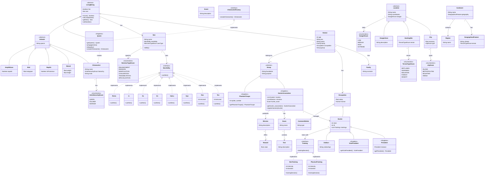

# Hunter x Hunter — Class Diagram

```mermaid
classDiagram

%% ───────────────────────────────
%% CORE / LIVING BEING
%% ───────────────────────────────
class LivingBeing {
    <<abstract>>
    -boolean live
    -Nen nen
    +isLive() boolean
    +setLive(boolean)
    +getNen() Nen
    +setNen(Nen)
}

%% ───────────────────────────────
%% HUMANS & HUNTERS
%% ───────────────────────────────
class Human {
    -int age
    -String sex
    -String name
    -Family family
    -Occupation occupation
    -Group group
}

class Family {
    -String surname
}

class Occupation {
    -float salary
    -Human human
}

class Hunter {
    -int stars
    -int id
    -List~Training~ trainings
}

class President {
    <<Singleton>>
    -President instance
    +getPresident() President
}

class VicePresident {
    <<Singleton>>
    +getVicePresident() VicePresident
}

class Zodiacs {
    -String zodiacSign
}

class CommonWorker {
    -String type
}

class Training {
    <<interface>>
    +trainingSession()
}

class PhysicalTraining {
    -int intensity
    -int duration
    +trainingSession()
}

class NenTraining {
    -int intensity
    -int duration
    +trainingSession()
}

LivingBeing <|-- Human
Human "1" --> "1" Family : has
Human "1" --> "1" Occupation : has
Human "1" --> "0..1" Group : belongs to
Occupation <|-- Hunter
Hunter <|-- President
Hunter <|-- VicePresident
Hunter <|-- Zodiacs
Occupation <|-- CommonWorker
Training <|.. PhysicalTraining : implements
Training <|.. NenTraining : implements
Hunter "1" --> "*" Training : trains with

%% ───────────────────────────────
%% NEN SYSTEM
%% ───────────────────────────────
class Nen {
    -String name
    -NenAbility nenAbility
    -NenUserTypeEnum userType
    +ability()
}

class NenAbility {
    <<interface>>
    +useNen()
}

class NenUserTypeEnum {
    <<enumeration>>
    ENHANCEMENT
    EMISSION
    MANIPULATION
    CONJURATION
    TRANSMUTATION
    SPECIALIZATION
}

class Ten {
    -int tenLevel
    +useNen()
}

class Ren {
    -int renLevel
    +useNen()
}

class Gyo {
    +useNen()
}

class Hatsu {
    +useNen()
}

class En {
    +useNen()
}

class Ko {
    +useNen()
}

class In {
    +useNen()
}

class Restu {
    +useNen()
}

NenAbility <|.. Ten : implements
NenAbility <|.. Ren : implements
NenAbility <|.. Gyo : implements
NenAbility <|.. Hatsu : implements
NenAbility <|.. En : implements
NenAbility <|.. Ko : implements
NenAbility <|.. In : implements
NenAbility <|.. Restu : implements
Nen "1" --> "1" NenAbility : uses
Nen "1" --> "1" NenUserTypeEnum : typed by
LivingBeing "1" --> "0..1" Nen : has

%% ───────────────────────────────
%% GROUPS
%% ───────────────────────────────
class Group {
    <<abstract>>
    -String foundation
    -String purpose
}

class HunterAssociation {
    <<Singleton>>
    -List~Hunter~ hunters
    -List~Mission~ missions
    -Exam hunter_exam
    +getHunter_association() HunterAssociation
    +registerHunters(Hunter)
}

class PhantomTroupe {
    <<Singleton>>
    -int spider_number
    +getPhantomTroupe() PhantomTroupe
}

class Exam {
    -String name
}

class Mission {
    -String description
}

class Event {
    -String description
}

class Reward {
    -float value
}

class Test {
    -String description
}

Group <|-- HunterAssociation
Group <|-- PhantomTroupe
HunterAssociation "1" --> "*" Hunter : manages
HunterAssociation "1" --> "1" Exam : has
HunterAssociation "1" --> "*" Mission : publishes
Exam "1" --> "*" Test : contains
Mission "1" --> "1" Reward : offers

%% ───────────────────────────────
%% CHIMERA ANTS
%% ───────────────────────────────
class Animals {
    <<abstract>>
    -String specie
}

class ChimeraAnt {
    -String name
    -AntsHierarchyEnum hierarchy
    -String traits
}

class Queen {
    <<Singleton>>
    +getQueen() Queen
    +phagogenesis()
    +telepathy()
    +createChimeraAnt() ChimeraAnt
}

class ChimeraAntFactory {
    <<interface>>
    +createChimeraAnt() ChimeraAnt
}

class AntsHierarchyEnum {
    <<enumeration>>
    QUEEN
    SOLDIER
    WORKER
}

LivingBeing <|-- Animals
Animals <|-- ChimeraAnt
LivingBeing <|-- Queen
ChimeraAntFactory <|.. Queen : implements
Queen ..> ChimeraAnt : creates
ChimeraAnt "1" --> "1" AntsHierarchyEnum : has

%% ───────────────────────────────
%% ANIMALS & PLANTS
%% ───────────────────────────────
class Mamal {
    -float weight
    -float height
}

class Reptile {
    -boolean isPoisonous
}

class Bird {
    -float wingspan
}

class Amphibious {
    -boolean aquatic
}

Animals <|-- Mamal
Animals <|-- Reptile
Animals <|-- Bird
Animals <|-- Amphibious

%% ───────────────────────────────
%% TERRAIN / WORLD
%% ───────────────────────────────
class Location {
    <<abstract>>
    -String name
    -String coordinates
    -DangerEnum danger
}

class City {
    -float economy
    -cityEnum type
}

class Region {
    -String name
}

class Continent {
    -String name
    -GeographicalFeature geography
}

class HuntingSite {
    -TerrainTypeEnum terrain
}

class DangerZone {
    -String description
}

class GeographicalFeature {
    -String climate
    -TerrainTypeEnum terrain
}

class DangerEnum {
    <<enumeration>>
    LOW
    MEDIUM
    HIGH
    EXTREME
}

class TerrainTypeEnum {
    <<enumeration>>
    WETLANDS
    SAVANNAH
    MOUNTAIN
    FOREST
    DESERT
}

class cityEnum {
    <<enumeration>>
    ISLAND
    METROPOLITAN
    MOUNTAIN
    ARENA
}

Location <|-- City
Location <|-- HuntingSite
Location <|-- DangerZone
Location "1" --> "1" DangerEnum : rated
City "1" --> "1" cityEnum : typed
HuntingSite "1" --> "1" TerrainTypeEnum : terrain
Continent "1" --> "1" GeographicalFeature : has
Continent "1" --> "*" Region : contains
```
